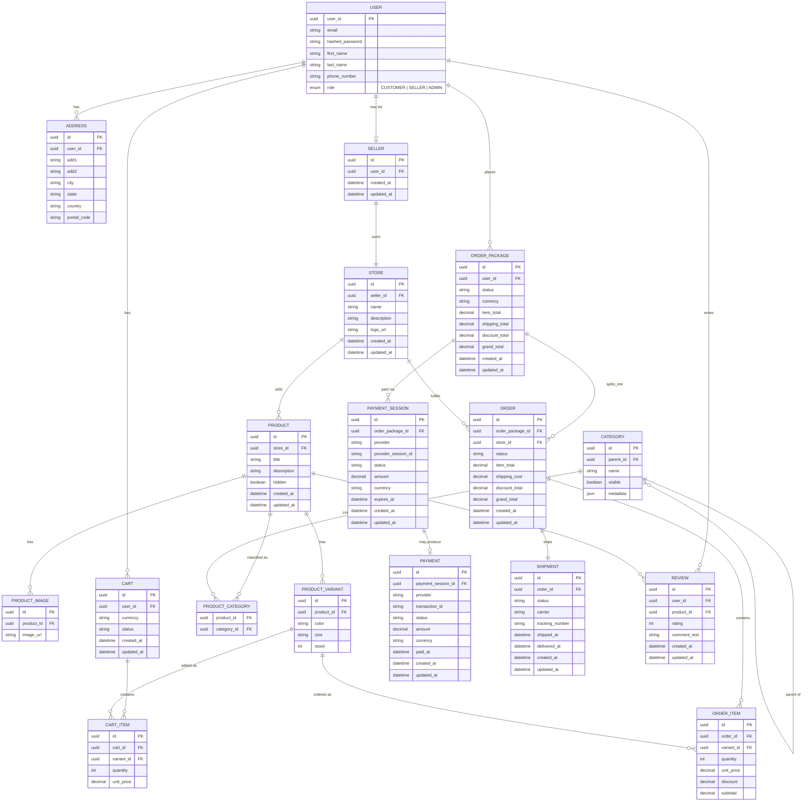

# Entity Relationship Diagram (ERD)

> This document describes the **database schema** for the Marketplace system.
> It translates the [Domain Model](Domain_Model.md) into concrete tables, keys, and relationships.
> The Mermaid source lives in [`ERD.mmd`](ERD.mmd).

---

## Overview

The schema supports a **multi-vendor marketplace**:

- Customers browse products, manage carts, and place orders.
- Sellers own stores and fulfill per-store orders.
- Admins manage the platform (same `USER` table, `role = ADMIN`).

Checkout is modeled as one **Order Package** (customer checkout) that may split into multiple **Orders** (one per store), each with its own **Shipment**. Payment goes through a **Payment Session** that may produce a successful **Payment**.

---

## Diagram

---

## Entities

### Identity & storefront

| Table | Purpose |
|-------|---------|
| **USER** | Single auth entity; role is `CUSTOMER`, `SELLER`, or `ADMIN` |
| **ADDRESS** | Shipping / billing addresses owned by a user |
| **SELLER** | Optional seller profile linked to a user (`USER` may be a seller) |
| **STORE** | Storefront owned by exactly one seller |

### Catalog

| Table | Purpose |
|-------|---------|
| **PRODUCT** | Product listing belonging to one store |
| **PRODUCT_IMAGE** | Images for a product |
| **PRODUCT_VARIANT** | Sellable SKU unit (color, size, stock) |
| **CATEGORY** | Shared hierarchical tree (`parent_id`); unique name per parent; **ADMIN** manages; public list is visible-only |
| **PRODUCT_CATEGORY** | Many-to-many link between products and categories |

### Cart & checkout

| Table | Purpose |
|-------|---------|
| **CART** | User shopping cart (currency + status) |
| **CART_ITEM** | Line item tied to a **variant** |
| **ORDER_PACKAGE** | Customer checkout aggregate (totals across sellers) |
| **ORDER** | Per-store slice of an order package |
| **ORDER_ITEM** | Line item on an order (variant + priced snapshot) |

### Payment & fulfillment

| Table | Purpose |
|-------|---------|
| **PAYMENT_SESSION** | Provider checkout session for an order package |
| **PAYMENT** | Successful (or recorded) payment produced by a session |
| **SHIPMENT** | One shipment per order (independent per seller) |

### Engagement

| Table | Purpose |
|-------|---------|
| **REVIEW** | Customer product review (rating + comment) |

---

## Key relationships

| From | To | Cardinality | Notes |
|------|-----|-------------|--------|
| USER | ADDRESS | 1:N | User has many addresses |
| USER | SELLER | 1:0..1 | User may be a seller |
| SELLER | STORE | 1:1 | Seller owns one store |
| STORE | PRODUCT | 1:N | Store sells many products |
| PRODUCT | PRODUCT_IMAGE | 1:N | |
| PRODUCT | PRODUCT_VARIANT | 1:N | Stock lives on the variant |
| CATEGORY | CATEGORY | 1:N | Parent / child hierarchy |
| PRODUCT ↔ CATEGORY | PRODUCT_CATEGORY | M:N | |
| USER | CART | 1:N | |
| CART | CART_ITEM | 1:N | Items reference variants |
| USER | ORDER_PACKAGE | 1:N | Checkout aggregate |
| ORDER_PACKAGE | ORDER | 1:N | One order per store in the package |
| STORE | ORDER | 1:N | Store fulfills its orders |
| ORDER | ORDER_ITEM | 1:N | |
| ORDER_PACKAGE | PAYMENT_SESSION | 1:N | Paid via session(s) |
| PAYMENT_SESSION | PAYMENT | 1:0..1 | Session may produce a payment |
| ORDER | SHIPMENT | 1:1 | One shipment per order |
| USER / PRODUCT | REVIEW | 1:N | User writes; product receives |

---

## Design notes

- **Seller is a separate table** — not every user is a seller; `SELLER` links `USER` → `STORE`.
- **Variants are the sellable unit** — cart and order items reference `PRODUCT_VARIANT`, not the parent product.
- **Order Package vs Order** — one customer payment checkout can span multiple sellers; each seller gets their own `ORDER` and `SHIPMENT`.
- **Payment Session vs Payment** — the session is the provider handshake; payment is the resulting transaction record.
- **Categories are hierarchical** via `CATEGORY.parent_id`.

---

## Source file

Edit the diagram in [`ERD.mmd`](ERD.mmd). Keep this document in sync when the schema changes.
